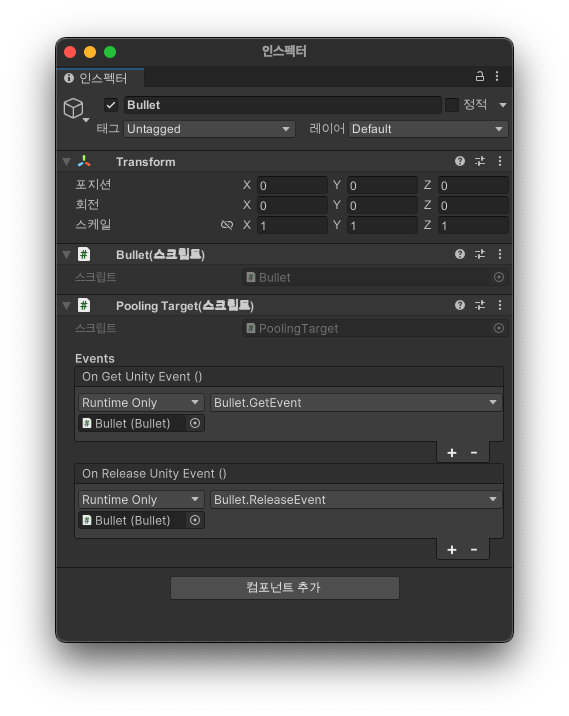

# AddressableUtility

## AddressablePools

### 사전 조건
- 풀링 처리를 하고 싶은 GameObject에 PoolingTarget 컴포넌트가 붙어 있어야 합니다. 
- 풀링 처리를 하고 싶은 GameObject에 어드레서블Key가 등록되어 있어야 합니다.

### 사용시 샘플 코드
```csharp
// 오브젝트 가져오기
PoolingTarget target = AddressablePools.Get("어드레서블Key");

// 오브젝트 돌려주기
target.Release();
```

### PoolingTarget
- AddressablePools에서 오브젝트를 가져올때 / 돌려줄때 이벤트를 등록할 수 있습니다.
  - OnGetUnityEvent 
  - OnReleaseUnityEvent

### PoolingTarget 이벤트 샘플

```csharp
public class Bullet : MonoBehaviour
{
    public void GetEvent()
    {
        Debug.Log("Get!");
    }
    
    public void ReleaseEvent()
    {
        Debug.Log("Release!");
    }
}
```




## AddressableMaker

### 사전 조건
- 만들려는 GameObject에 어드레서블Key가 등록되어 있어야 합니다.

### 사용 방법
```csharp
GameObject target = AddressableMaker.Make("어드레서블Key");

// target 오브젝트가 삭제 되면 자동으로 ReleaseInstance 처리가 됩니다.
Destroy(target);

// 생성과 동시에 컴포넌트 형태로 받아올 수 있습니다. 내부에서 생성 후 GetComponent를 이용해 반환 합니다.
Bullet bullet = AddressableMaker.Make<Bullet>("어드레서블Key");

Destroy(bullet.gameObject);
```